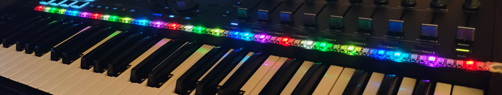

# DreamScaler

An LED strip that displays musical scales on your piano or keyboard.

[Explore DreamScaler](https://tomasmark79.github.io/DreamScaleProduct/) · [Watch the Bitwig demo](https://www.youtube.com/watch?v=vPi2TyJrofc)

## Two ways to use it

**Scale display:** choose a root note and one of 60+ scales in the application. The corresponding keys light up in color. No MIDI connection is required.

**MIDI response:** connect MIDI input from your keyboard or music software to make the lights follow played notes and their velocity.

Both modes use the DreamScaler Python application on **Windows or Linux**, a USB connection to the controller, and external power for the strip. Bitwig Studio integration is optional.

## Fits your instrument

The **1-metre RGBW strip has 144 LEDs**, spaced closely enough to align with white and black keys. Attach it wherever your instrument has a suitable surface and enough room, and trim it at the marked cut points if needed.

LED positions are assigned to keys in a configuration file. The Arturia KeyLab configurations serve as templates for other layouts. Scale display also works on acoustic pianos; responding to played notes requires MIDI input.

## Availability

**First kits coming soon.** Pricing and ordering details will be published on the website.

The video shows playback in Bitwig Studio. The standalone application is planned for a redesign and will be presented separately.

© Tomas Mark
